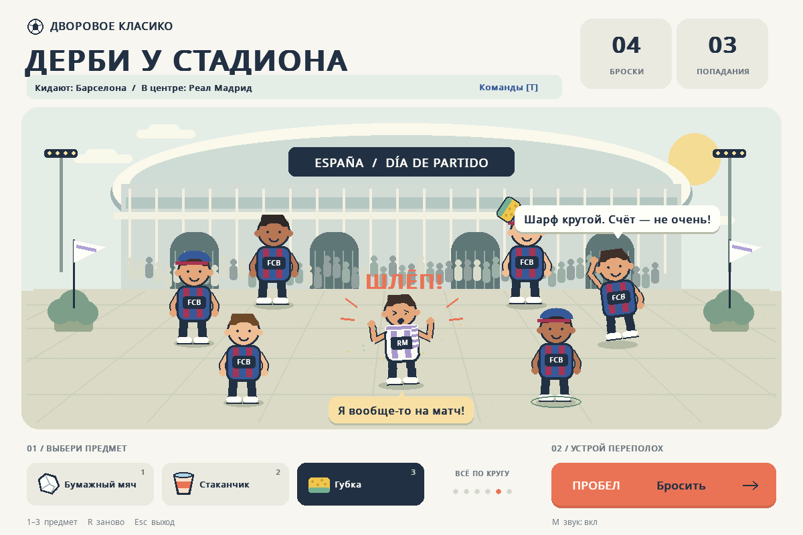

# Дерби у стадиона

Небольшая настольная игра на Python и Pygame. По умолчанию фанат «Реала» стоит у стадиона, а вокруг него — фанаты «Барселоны». Обе команды можно поменять кнопкой «Команды» или клавишей T. Нажмите пробел, чтобы запустить мультяшный бросок бумажного мяча, стаканчика или губки с футбольным подколом.

Вся графика рисуется кодом, а звуки синтезируются при запуске. Внешние изображения и аудиофайлы не нужны.



## Установка и запуск

Требуется Python 3.10 или новее. Для игры нужен компьютер с графическим окружением; в облачной среде без экрана доступна проверка запуска.

### Скачать игру с GitHub

1. Откройте [страницу проекта](https://github.com/akimdubeyko-dotcom/calculator).
2. Нажмите зелёную кнопку **Code**, затем **Download ZIP**.
3. Распакуйте скачанный ZIP-архив. Появится папка `calculator-main` с файлами `game.py` и `requirements.txt`.

### macOS с установленным Python 3.15

Следующие команды используют установленный Python 3.15.

Откройте приложение **Терминал / Terminal**. Если распакованная папка находится в «Загрузках», выполните:

```bash
cd ~/Downloads/calculator-main
```

Если папка находится в другом месте, напечатайте `cd ` с пробелом в конце, перетащите папку `calculator-main` из Finder в окно терминала и нажмите Enter.

Затем выполните эти три команды по очереди, нажимая Enter после каждой:

```bash
python3.15 -m venv .venv
.venv/bin/python -m pip install -r requirements.txt
.venv/bin/python game.py
```

Первая команда создаёт отдельное окружение для игры, вторая устанавливает Pygame, третья открывает окно игры. Дождитесь завершения установки перед запуском следующей команды.

Для следующих запусков откройте терминал в той же папке и выполните только:

```bash
.venv/bin/python game.py
```

### Linux и другие версии Python на macOS

Откройте терминал в распакованной папке `calculator-main` и выполните:

```bash
python3 -m venv .venv
.venv/bin/python -m pip install -r requirements.txt
.venv/bin/python game.py
```

Команда `python3` должна запускать Python 3.10 или новее. Если на Mac она показывает системную версию 3.9, а Python 3.15 уже установлен, используйте инструкции для `python3.15` выше.

### Windows (PowerShell)

Откройте распакованную папку `calculator-main` в Проводнике. Нажмите на адресную строку, введите `powershell` и нажмите Enter. Затем выполните:

```powershell
py -3 -m venv .venv
.\.venv\Scripts\python.exe -m pip install -r requirements.txt
.\.venv\Scripts\python.exe game.py
```

Для следующих запусков из этой папки достаточно команды `.\.venv\Scripts\python.exe game.py`.

Если виртуальное окружение уже активировано, игру можно запустить командой `python game.py`.

## Управление

| Клавиша или кнопка | Действие |
| --- | --- |
| Пробел или кнопка броска на экране | Запустить бросок и анимацию |
| `1`, `2`, `3` | Выбрать бумажный мяч, стаканчик или губку |
| `T` или «Команды» | Выбрать бросающих болельщиков и фаната в центре |
| `Enter` или `Esc` в выборе команд | Вернуться в игру |
| `R` | Сбросить раунд, сохранив команды |
| `M` | Включить или выключить звук |
| `Esc` | Выйти из игры |

Можно выбрать «Барселону», «Реал Мадрид», «Атлетико Мадрид», «Севилью», «Реал Бетис», «Валенсию», «Вильярреал», «Атлетик Бильбао», «Реал Сосьедад» и «Жирону». Меняются цвета формы, шарфы, подписи и реплики. Смена команды начинает новый раунд; выбор клуба соперника меняет стороны местами. Пока открыто меню, игра приостановлена.

## Проверки

Запускайте команды из папки проекта с активированным виртуальным окружением или замените `python` на путь к его интерпретатору из инструкции выше.

Тесты:

```bash
python -m unittest discover -s tests -v
```

Проверка запуска без экрана с сохранением снимка:

```bash
python game.py --smoke-test --screenshot artifacts/smoke.png
```

Безэкранная проверка подходит для облачной среды. Для интерактивной игры запустите `python game.py` на компьютере с графическим окружением.
